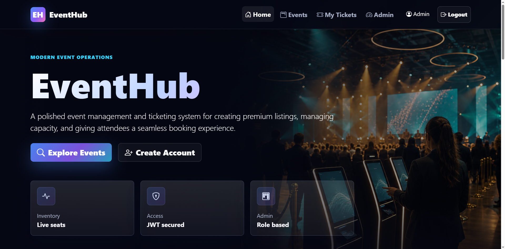
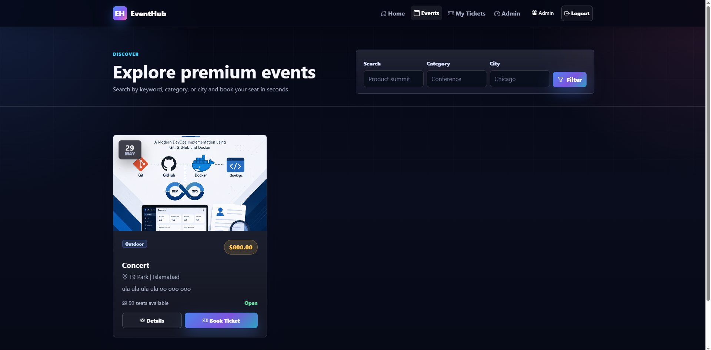
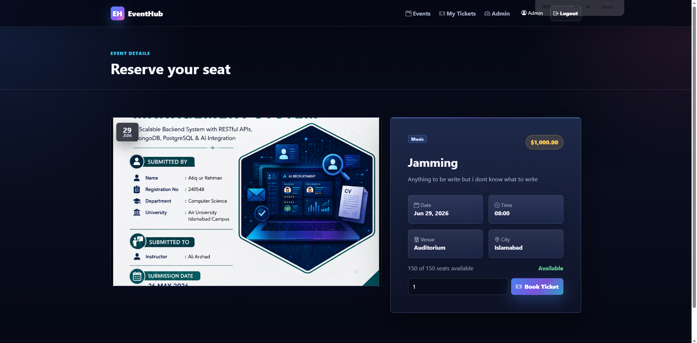
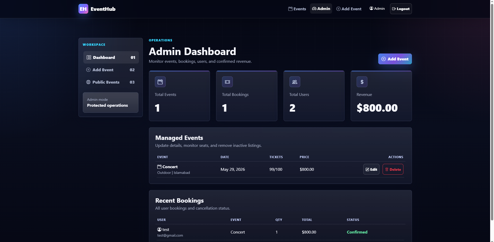
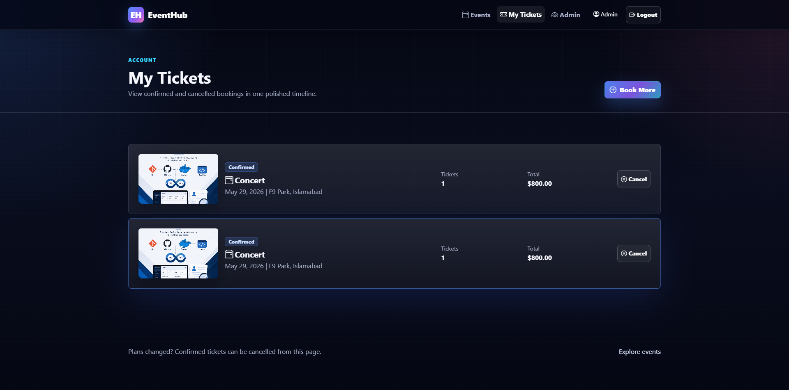
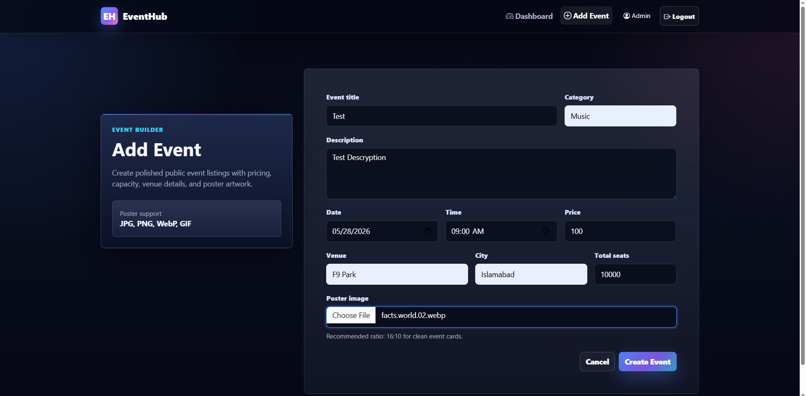

<div align="center">

# 🎟️ EventHub

## Premium Event Management & Ticketing System

**A professional full-stack event platform built with Node.js, Express, MongoDB, Bootstrap 5, and Vanilla JavaScript.**


</div>

---

## 📌 Project Overview

EventHub is a premium full-stack event management and ticketing system designed as a portfolio-ready SaaS-style web application. It allows users to discover events, register accounts, book tickets, manage their bookings, and cancel tickets when needed.

Admins can create and manage event listings, upload event posters, monitor bookings, and view dashboard metrics such as total events, bookings, users, and revenue.

The project focuses on clean architecture, secure authentication, responsive UI/UX, role-based authorization, and practical backend workflows.

---

## ✨ Features

- 🔐 JWT-based authentication
- 🔑 Secure password hashing with bcryptjs
- 👤 User and admin roles
- 🧾 User registration and login
- 🎫 Ticket booking with seat availability tracking
- ❌ Ticket cancellation with inventory restoration
- 🗂️ Admin event CRUD operations
- 🖼️ Event poster image uploads with multer
- 📊 Admin dashboard with platform metrics
- 📋 Recent bookings table
- 🔎 Public event listing and event details pages
- 💎 Premium dark SaaS-style UI
- 📱 Fully responsive layout for mobile, tablet, and desktop
- 🔔 Toast notifications and loading states
- 🧪 API tests for major user/admin flows

---

## 🛠️ Tech Stack

| Layer | Technology |
| --- | --- |
| Frontend | HTML, CSS, Bootstrap 5, Vanilla JavaScript |
| Backend | Node.js, Express.js |
| Database | MongoDB, Mongoose |
| Authentication | JWT |
| Password Hashing | bcryptjs |
| File Uploads | multer |
| Styling | Custom CSS, Bootstrap Icons |
| Testing | Node test runner, supertest |

---

## 🖼️ Screenshots

| Home Page                             | Events Page                       |
| ------------------------------------- | --------------------------------- |
|  |  |

| Event Details                                   | Admin Dashboard                               |
| ----------------------------------------------- | --------------------------------------------- |
|  |  |

| My Tickets                             | Add Event                               |
| -------------------------------------- | --------------------------------------- |
|  |  |


---

## 📁 Folder Structure

```text
event-management-ticketing-system/
  backend/
    config/
      db.js
    middleware/
      authMiddleware.js
      uploadMiddleware.js
    models/
      User.js
      Event.js
      Booking.js
    routes/
      authRoutes.js
      eventRoutes.js
      bookingRoutes.js
    scripts/
      createAdmin.js
    tests/
      api.test.js
    uploads/
      events/
    .env.example
    package.json
    server.js

  frontend/
    assets/
      css/
        styles.css
      images/
        eventhub-hero.png
      js/
        api.js
        auth.js
        events.js
        tickets.js
        admin.js
    index.html
    login.html
    register.html
    events.html
    event-details.html
    my-tickets.html
    admin-dashboard.html
    add-event.html

  README.md
```

---

## ⚙️ Installation

### 1. Clone the repository

```bash
git clone https://github.com/atiqurrehman112/event-management-ticketing-system
cd event-management-ticketing-system
```

### 2. Install backend dependencies

```bash
cd backend
npm install
```

### 3. Create environment file

PowerShell:

```powershell
Copy-Item .env.example .env
```

macOS/Linux:

```bash
cp .env.example .env
```

### 4. Start the backend server

```bash
npm run dev
```

The backend API runs at:

```text
http://localhost:5000/api
```

---

## 🔧 Environment Setup

Create `backend/.env` and configure:

```env
PORT=5000
MONGO_URI=mongodb://127.0.0.1:27017/eventhub
JWT_SECRET=replace_this_with_a_long_random_secret
JWT_EXPIRES_IN=7d
CLIENT_URL=http://localhost:5500,http://127.0.0.1:5500

ADMIN_NAME=EventHub Admin
ADMIN_EMAIL=admin@eventhub.local
ADMIN_PASSWORD=Admin@12345
```

Recommended production notes:

- Use a long, random `JWT_SECRET`.
- Do not commit `.env`.
- Use MongoDB Atlas or a managed MongoDB instance for deployment.
- Restrict `CLIENT_URL` to trusted frontend origins.

---

## 🍃 MongoDB Setup

### Local MongoDB

Install and start MongoDB locally, then use:

```env
MONGO_URI=mongodb://127.0.0.1:27017/eventhub
```

### MongoDB Atlas

Replace `MONGO_URI` with your Atlas connection string:

```env
MONGO_URI=mongodb+srv://<username>:<password>@<cluster-url>/eventhub
```

Make sure your Atlas cluster allows connections from your IP address.

---

## 👑 Admin Credentials

Admin users are created through the seed script.

Set these values in `backend/.env`:

```env
ADMIN_NAME=EventHub Admin
ADMIN_EMAIL=admin@eventhub.local
ADMIN_PASSWORD=Admin@12345
```

Run:

```bash
cd backend
npm run seed:admin
```

Then log in from:

```text
frontend/login.html
```

Admin accounts can:

- Create events
- Edit events
- Delete events without active bookings
- View all bookings
- View dashboard metrics

---

## 🖥️ Frontend Usage

Open the frontend directly in your browser:

```text
frontend/index.html
```

Or serve it with a static server:

```bash
cd frontend
npx serve .
```

The frontend calls this API by default:

```text
http://localhost:5000/api
```

To override the API URL from the browser console:

```js
localStorage.setItem('eventhubApiBase', 'http://localhost:5000/api');
```

---

## 📡 API Endpoints

### Auth Routes

| Method | Endpoint | Access | Description |
| --- | --- | --- | --- |
| POST | `/api/auth/register` | Public | Register a new user |
| POST | `/api/auth/login` | Public | Login and receive JWT |
| GET | `/api/auth/me` | Authenticated | Get current user profile |
| GET | `/api/auth/users/count` | Admin | Get total user count |

### Event Routes

| Method | Endpoint | Access | Description |
| --- | --- | --- | --- |
| GET | `/api/events` | Public | Get all events |
| GET | `/api/events/:id` | Public | Get a single event |
| POST | `/api/events` | Admin | Create event with optional poster |
| PUT | `/api/events/:id` | Admin | Update event with optional poster |
| DELETE | `/api/events/:id` | Admin | Delete event if no active bookings exist |

### Booking Routes

| Method | Endpoint | Access | Description |
| --- | --- | --- | --- |
| POST | `/api/bookings` | Authenticated | Book tickets for an event |
| GET | `/api/bookings/mine` | Authenticated | View logged-in user's tickets |
| PATCH | `/api/bookings/:id/cancel` | Owner/Admin | Cancel a booking |
| GET | `/api/bookings/admin` | Admin | View all bookings |

---

## 🧪 Testing

Run the backend API test suite:

```bash
cd backend
npm test
```

The tests cover:

- User registration
- User login
- Admin login
- Admin event creation
- Event listing and details
- Event update
- Ticket booking
- My tickets
- Ticket cancellation
- Admin booking view
- Admin authorization
- Poster upload path handling

To use a custom test database:

```env
TEST_MONGO_URI=mongodb://127.0.0.1:27017/eventhub_test
```

---

## 🚀 Future Improvements

- 💳 Payment gateway integration
- 📧 Email ticket confirmations
- 📱 QR code ticket generation
- 🔍 Advanced filtering and pagination
- 🧑‍💼 Organizer profiles
- 📈 Analytics charts for admin dashboard
- 🪪 Ticket check-in workflow
- ☁️ Cloud image storage with Cloudinary or S3
- 🌐 Deployment guide for Render, Railway, or Vercel static hosting
- 🧾 Downloadable ticket PDFs

---

## 🧾 Available Scripts

Run from the `backend/` folder:

```bash
npm start          # Start backend server
npm run dev        # Start backend with nodemon
npm test           # Run API tests
npm run seed:admin # Create or update admin user
```

---

---

## 👨‍💻 Author

**Atiq ur Rehman**

* GitHub: [@243472-hash](https://github.com/243472-hash)
* LinkedIn: [Atiq ur Rehman](https://www.linkedin.com/in/atiq261)
* University: Air University Islamabad Campus
* Department: Computer Science

---

## 📄 License

This project is licensed under the **MIT License**.

You are free to use, modify, and distribute this project for learning, portfolio, and professional demonstration purposes.

---

<div align="center">

### ⭐ If you like this project, consider starring the repository.

Built with Node.js, Express.js, MongoDB, Bootstrap 5, and Vanilla JavaScript.

</div>
